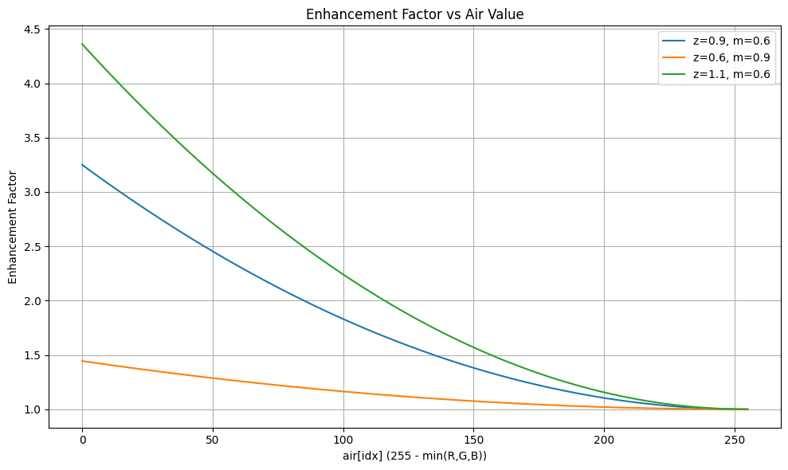

# Low-Light Image Enhancement using CUDA and Python

This code implements a real-time low-light image enhancement algorithm using CUDA and Python (video implemenation). The method emphasizes dark regions in RGB images using a dark channel prior and adaptive gain control. A companion Jupyter Notebook is also included to visualize the enhancement behavior.

## 🛠️ Folder Structure

```
├── lle.cu             # CUDA-based enhancement implementation
├── lle.ipynb          # Python-based enhancement implemntation for video
├── lle\_plot.ipynb    # Python notebook to visualize enhancement factors
├── low\_light\_img.jpg   # Sample input image
└── README.md           # This file

````

---

## 📸 Problem Overview

In low-light endoscopic images, distant or tubular regions often appear very dark. To improve visibility while preserving structure and avoiding overexposure, an enhancement technique was developed. It increases brightness adaptively based on pixel intensity.

---

## CUDA Pipeline Overview

### 1. **Image Input**
- Image (`low_light_img.jpg`) is loaded using OpenCV and converted from BGR to RGB.
- Input image is uploaded to GPU in `uchar` format and then converted to `float`.

### 2. **Dark Channel Inversion**
```cpp
D(x, y) = 255 - min{R(x,y), G(x,y), B(x,y)}
````

* This dark channel emphasizes regions that are dark across all color channels.

### 3. **Smoothing**

* An iterative 3×3 Gaussian filter is applied using `nppiFilterGaussBorder_32f_C1R` from NPP.
* Helps reduce noise and preserve important structures in the dark region mask.

### 4. **Enhancement Factor Computation**

```cpp
factor = 1 + ((z / (255 * m)) * A_s(x, y))^2
```

Where:

* `A_s(x,y)` is the smoothed dark channel
* `z` and `m` are tunable constants controlling strength and sensitivity

### 5. **Final Enhancement**

Each RGB channel is scaled by the computed factor and clipped to `[0, 255]`:

```cpp
Ec(x,y) = min(255, max(0, Ic(x,y) * factor))
```

---

## 📈 Notebook: Visualizing Enhancement Behavior

The included Jupyter Notebook (`lle_plot.ipynb`) helps understand how the enhancement factor varies with pixel darkness using the formula:

```python
factor = 1 + ((z / (255 * m)) * (255 - min(R, G, B)))^4
```

* Different settings of `z` and `m` are compared.
* This visualization guides parameter tuning for best enhancement quality.



---

## ⚙️ Build and Run Instructions

### Prerequisites:

For CUDA implementation 
* CUDA toolkit installed
* OpenCV with CUDA support
* NPP library (`libnpp*`)
* NVIDIA GPU


### Compile:

```bash
nvcc lle.cu -o enhance_app `pkg-config --cflags --libs opencv4` -lnppif
```

### Run:

```bash
./enhance_app
```

---

## 🧪 Parameters

| Parameter    | Description                                                      |
| ------------ | ---------------------------------------------------------------- |
| `z`          | Enhancement strength (higher `z` → more aggressive gain)         |
| `m`          | Controls sensitivity to darkness (lower `m` → more gain in dark) |
| `iterations` | Number of Gaussian filter passes                                 |

---

## 📚 Reference

The enhancement method is inspired by Matlab's Low Light Enhancement - https://in.mathworks.com/help/visionhdl/ug/low-light-enhancement.html 

---

